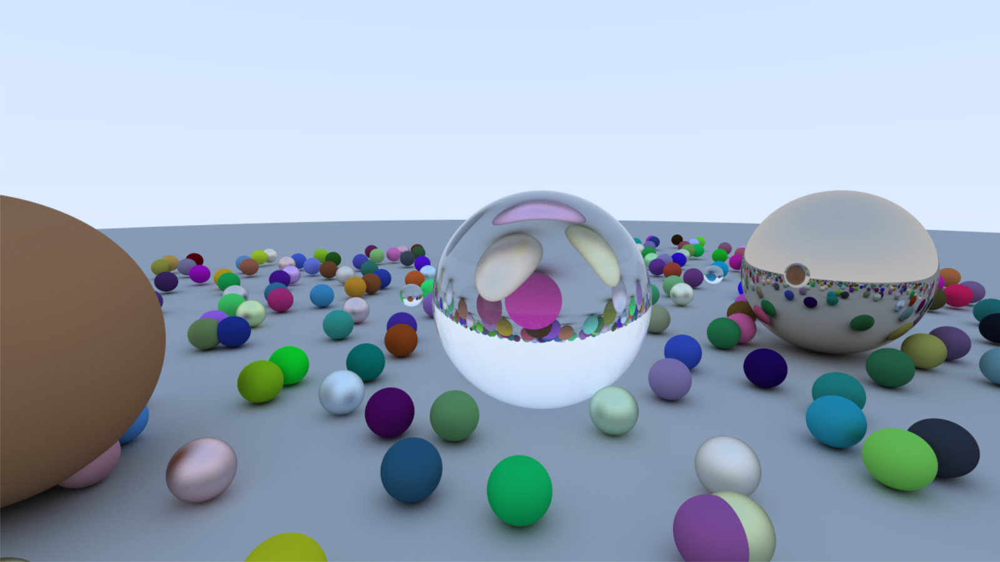

# Ray tracing in a weekend
[RTIW](https://raytracing.github.io/books/RayTracingInOneWeekend.html) implementation done in C++.

Made via [OLC PGE](https://github.com/OneLoneCoder/olcPixelGameEngine)

